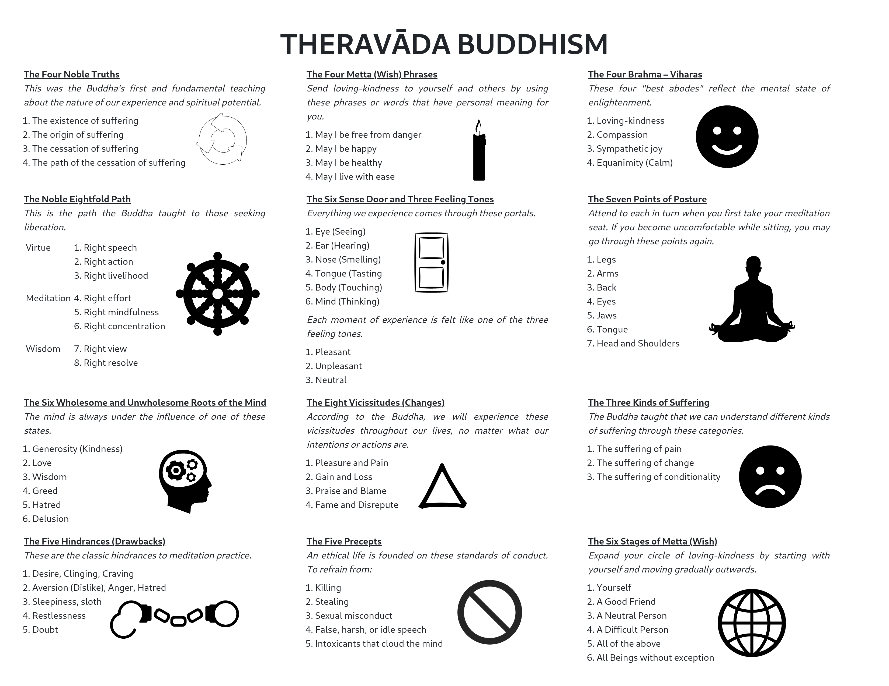

# Buddhism Cheatsheet

# Rendering

Personally I open [index.html](index.html) in Firefox and take a full-page screenshot with Ctrl+Shift+S.

# Copyright Attribution

## Creative Commons

[Font_Awesome_5_solid_smile.svg](./images/Font_Awesome_5_solid_smile.svg) Font Awesome Free 5.2.0 by @fontawesome - https://fontawesome.com, CC BY 4.0 <https://creativecommons.org/licenses/by/4.0>, via Wikimedia Commons

[Font_Awesome_5_solid_frown.svg](./images/Font_Awesome_5_solid_frown.svg) Font Awesome Free 5.2.0 by @fontawesome - https://fontawesome.com, CC BY 4.0 <https://creativecommons.org/licenses/by/4.0>, via Wikimedia Commons

[Door-liftarn-Door-white-stroke.svg](./images/Door-liftarn-Door-white-stroke.svg) gammillian, CC0, via Wikimedia Commons

[Lotus_position.svg](./images/Lotus_position.svg) Bryan Helfrich, Alias52, CC BY-SA 3.0 <https://creativecommons.org/licenses/by-sa/3.0>, via Wikimedia Commons

[Greek_Delta_classical.svg](./images/Greek_Delta_classical.svg) Future Perfect at Sunrise, CC0, via Wikimedia Commons

[Noun_mind_366997.svg](./images/Noun_mind_366997.svg) Rflor, CC BY 4.0 <https://creativecommons.org/licenses/by/4.0>, via Wikimedia Commons

## Public Domain, for reference

[candle.svg](./images/candle.svg) by Inkie30 obtained from [Openclipart](https://openclipart.org/detail/231774/candle)

[cycle-3.svg](./images/cycle-3.svg) by lmproulx obtained from [Openclipart](https://openclipart.org/detail/118339/cycle)

[open-handcuffs.svg](./images/open-handcuffs.svg) by qubodup obtained from [Openclipart](https://openclipart.org/detail/171929/open-handcuffs)

[Dharmacakra.png](./images/Dharmacakra.svg) Liebeskind, Public domain, via Wikimedia Commons

[Globe icon.svg](./images/Globe_icon.svg) Sarang, Public domain, via Wikimedia Commons

[ProhibitionSign2.svg](./images/ProhibitionSign2.svg) GravisZro, Public domain, via Wikimedia Commons